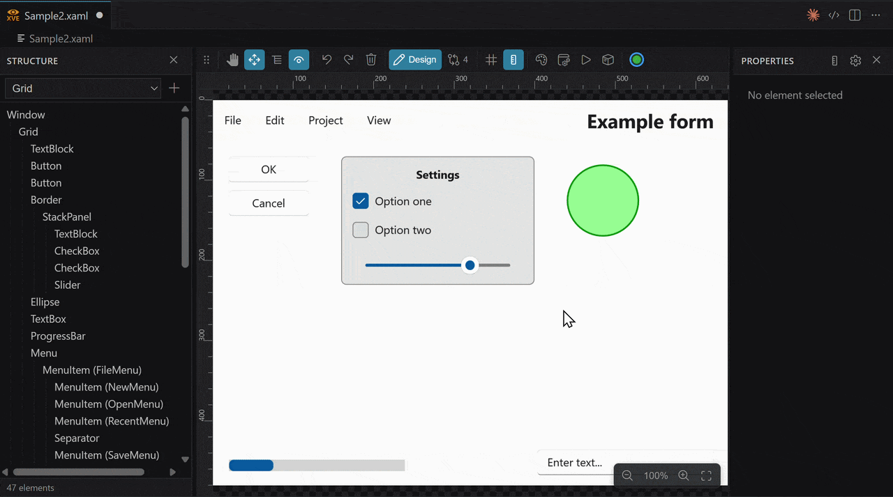

# XAML Visual Editor (XVE) — VS Code extension

A visual editor for hand-written **XAML** files inside VS Code — a structure tree, a live
preview and a typed properties panel — with a defining feature: **surgical save**. An edit
changes only what it must; the rest of the file stays byte-for-byte identical (formatting,
comments and indentation are preserved).

> 📖 **Full documentation:**
> [🇬🇧 English](docs/en/DOCUMENTATION.md) ·
> [🇵🇱 Polski](docs/pl/DOKUMENTACJA.md) ·
> [🇪🇸 Español](docs/es/DOCUMENTACION.md) ·
> [🇩🇪 Deutsch](docs/de/DOKUMENTATION.md) ·
> [🇫🇷 Français](docs/fr/DOCUMENTATION.md) ·
> [🇯🇵 日本語](docs/ja/DOCUMENTATION.md) ·
> [🇨🇳 中文](docs/zh/DOCUMENTATION.md)



## Requirements

- **VS Code** `^1.90`.
- The cross-platform **web renderer** works out of the box on Windows, macOS and Linux —
  nothing else to install.
- The high-fidelity **WPF preview host** is optional and Windows-only (**x64 and ARM64**; a native
  app host ships for each). Nothing to compile — but it needs the
  **[.NET 10 Desktop Runtime](https://dotnet.microsoft.com/download/dotnet/10.0)** installed, in the
  same architecture as your VS Code. Note this is the *Desktop* runtime, a separate download from
  the plain .NET runtime. Without it XVE falls back to the web renderer and tells you why.

## Features

- **Visual editing** — select, drag-to-move (`Margin` / `Canvas.*`) and resize (8 handles) with
  a live preview; everything committed as one surgical write.
- **Structure tree** with drag-to-reorder, and a **typed properties panel** (bool, enum, brush,
  number, thickness, string) with add/remove and per-attribute revert.
- **Changes view** — a diff against the saved file (changed / added / removed / moved elements)
  with revert-per-hunk and Revert-all.
- **Two preview engines** — a cross-platform **web renderer** (including `{StaticResource}`,
  `Style`/`Setter`, `BasedOn` chains and implicit styles) and a Windows-only, high-fidelity
  **WPF host** (real WPF engine, themes, HiDPI supersampling, custom-control resources).
- **Zoom** 10–800 % (Ctrl+scroll, Fit), rulers, guides and snap-to-grid.
- **Two-way selection sync** with a side-by-side text editor, and a **localized UI** (7 languages).

See the [full documentation](docs/en/DOCUMENTATION.md) for a complete tour of every feature,
the settings reference and the architecture.

## Quick start (dev)

```bash
npm install
npm run compile        # bundles the extension + webview into dist/
npm run test:unit      # core unit tests (Node test runner, type stripping)
npm run test:parity    # web renderer vs WPF host rendering parity (Playwright)
```

In VS Code press **`F5`** → *Run Extension*, then in the new window open any `.xaml` file (or run
**“XVE: Open in XAML Visual Editor”**). On Windows, build the high-fidelity preview host with
`npm run build:host` (this one requires the .NET 10 **SDK**, not just the runtime).

Regenerate the documentation images (diagrams and toolbar icons) with `npm run docs:images`.

## Architecture (overview)

```
Extension host (Node/TS)                  Webview (HTML/CSS/TS)
  extension.ts                              main.ts         — tree, source, properties
  XveEditorProvider    ── postMessage ───   renderer.ts     — web XAML→DOM
  core/XamlDocument    (surgical save)      styleResolver.ts— XAML styles → CSS
  core/XamlParser      (tokenizer + offsets)style.css
  core/StructuralDiff  (LCS tree diff)
  core/TypeRegistry    (types + properties)
  core/ResourceModel   (brushes, styles, BasedOn)
  core/ProjectScanner  (csproj → DLLs, dictionaries)
  core/PasteNames      (x:Name deduplication)
  core/Localization    (7 languages)
  host/WpfHost   ───── JSON-lines over stdio ───▶ wpf-host (Windows, .NET 10)
                                                  real WPF → PNG + hit-test
```

More detail — including diagrams of the architecture and the edit flow — is in the
[full documentation](docs/en/DOCUMENTATION.md#11-architecture).

## Related project

The WPF desktop application [**XamlVisualEditor**](https://github.com/Zete-Pl/XamlVisualEditor)
is a separate repository. It serves as a behavioral reference for this extension; no code is
shared between the two.

## License

[Apache License 2.0](LICENSE).
