# XAML Visual Editor (XVE) — Dokumentacja

[🇬🇧 English](../en/DOCUMENTATION.md) · **🇵🇱 Polski** · [🇪🇸 Español](../es/DOCUMENTACION.md) · [🇩🇪 Deutsch](../de/DOKUMENTATION.md) · [🇫🇷 Français](../fr/DOCUMENTATION.md) · [🇯🇵 日本語](../ja/DOCUMENTATION.md) · [🇨🇳 中文](../zh/DOCUMENTATION.md)

XVE to wtyczka do Visual Studio Code, która zamienia ręcznie pisane pliki **XAML** w żywą,
edytowalną powierzchnię wizualną — drzewo struktury, renderowany podgląd i typowany panel
właściwości — zachowując plik tekstowy jako jedyne źródło prawdy. Cechą wyróżniającą jest
**chirurgiczny zapis (surgical save)**: edycja zmienia wyłącznie to, co konieczne, a reszta
pliku pozostaje bajt-w-bajt nietknięta (formatowanie, komentarze i wcięcia są zachowane).

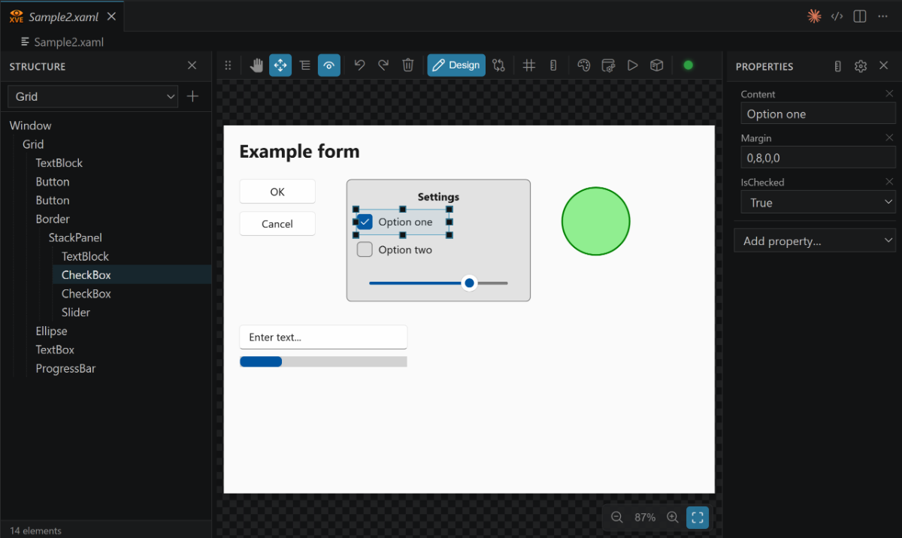

---

## Spis treści

1. [Wprowadzenie](#1-wprowadzenie)
2. [Instalacja i uruchomienie](#2-instalacja-i-uruchomienie)
3. [Pierwsze kroki](#3-pierwsze-kroki)
4. [Interfejs](#4-interfejs)
5. [Funkcje](#5-funkcje)
6. [Backendy podglądu](#6-backendy-podglądu)
7. [Zasoby projektu (host WPF)](#7-zasoby-projektu-host-wpf)
8. [Obsługa błędów](#8-obsługa-błędów)
9. [Wykaz ustawień](#9-wykaz-ustawień)
10. [Skróty klawiszowe](#10-skróty-klawiszowe)
11. [Architektura](#11-architektura)
12. [Pliki przykładowe](#12-pliki-przykładowe)
13. [Rozwiązywanie problemów / FAQ](#13-rozwiązywanie-problemów--faq)
14. [Historia rozwoju](#14-historia-rozwoju)

---

## 1. Wprowadzenie

XVE powstał dla programistów, którzy piszą WPF/XAML ręcznie, ale chcą podglądu jak w
projektancie i szybkich wizualnych poprawek — bez narzędzia, które przepisuje (i przeformatowuje)
ich znaczniki.

Kluczowe idee:

- **Edytor własny dla `*.xaml`** — zarejestrowany jako *opcja*, więc w każdej chwili możesz
  przełączać się między edytorem wizualnym a zwykłym edytorem tekstu.
- **Chirurgiczny zapis** — każda zmiana jest nanoszona jako najmniejsza możliwa edycja tekstu
  oryginału. Natywne **cofnij/ponów** VS Code działa, bo wszystkie edycje przechodzą przez
  `TextDocument`.
- **Dwa silniki podglądu** — wieloplatformowy **web renderer** oraz dostępny tylko na Windows,
  wysokiej wierności **host WPF**, renderujący prawdziwym silnikiem WPF.
- **Zlokalizowany interfejs** — 7 języków (English, Polski, Español, Deutsch, Français,
  日本語, 中文).

---

## 2. Instalacja i uruchomienie

### Wymagania

| Komponent | Wymaganie |
|-----------|-----------|
| VS Code | `^1.90.0` |
| Host WPF — *używanie* (opcjonalnie) | Windows x64 lub ARM64 + **[.NET 10 Desktop Runtime](https://dotnet.microsoft.com/download/dotnet/10.0)** |
| Host WPF — *budowanie* (tylko dev) | Windows + **.NET 10 SDK** |
| Node.js (tylko dev) | ≥ 20 (testy jednostkowe używają type-stripping z Node ≥ 22/24) |

Po instalacji z Marketplace nie trzeba niczego kompilować: rozszerzenie niesie gotowy
`xve-wpf-host.exe` dla **x64 i ARM64** i w czasie działania wybiera wariant pasujący do Twojego
VS Code.

Potrzebne jest natomiast środowisko **Desktop** (`Microsoft.WindowsDesktop.App`) — osobny plik do
pobrania niż zwykłe środowisko .NET — **w tej samej architekturze co VS Code**. VS Code w wersji
ARM64 wymaga środowiska Desktop ARM64. Gdy go brakuje, XVE pokazuje powiadomienie z linkiem do
pobrania i przechodzi na web renderer.

Wtyczka działa wszędzie tam, gdzie VS Code. **Host WPF jest opcjonalny** i tylko dla Windows;
na innych platformach (lub gdy host jest niedostępny) używany jest web renderer.

### Uruchomienie ze źródeł (dev)

```bash
npm install
npm run compile        # bunduje extension + webview do dist/
npm run test:unit      # testy jednostkowe rdzenia (Node test runner, type stripping)
npm run test:parity    # zgodność renderu: web renderer vs host WPF (Playwright)
npm run docs:images    # ponowny render diagramów i ikon paska w docs/images/
```

`test:parity` renderuje fikstury z `samples/parity/` przez oba backendy i porównuje wynikową
geometrię; wymaga zbudowanego hosta WPF (patrz niżej), więc działa tylko na Windows.

`docs:images` renderuje każdy `docs/images/*.svg` do PNG, eksportuje ikony paska narzędzi
z `@vscode/codicons` i skaluje zrzuty ekranu w miejscu do szerokości 1200 px. Jest idempotentny —
obrazek mieszczący się już w limicie zostaje nietknięty — więc możesz wrzucić kadr w pełnej
rozdzielczości i po prostu uruchomić skrypt ponownie.

Następnie w VS Code naciśnij **`F5`** → *Run Extension*. W nowym oknie Extension Development Host
otwórz dowolny plik `.xaml` (albo uruchom **„XVE: Open in XAML Visual Editor”** z palety komend).

### Budowa hosta WPF (tylko Windows)

```bash
npm run build:host     # dotnet build wpf-host -c Release  (wymaga .NET 10 SDK)
```

Powstaje `xve-wpf-host.exe`, który wtyczka uruchamia na żądanie dla podglądu wysokiej wierności.

---

## 3. Pierwsze kroki

1. **Otwórz plik XAML.** Ponieważ edytor wizualny jest zarejestrowany z `priority: "option"`,
   pliki `.xaml` domyślnie otwierają się w zwykłym edytorze tekstu.
2. **Przełącz na edytor wizualny.** Kliknij **„XVE: Open in XAML Visual Editor”** na pasku
   tytułu edytora albo uruchom komendę `xve.openVisualEditor` z palety komend.
3. **Wróć do tekstu.** Gdy edytor wizualny jest aktywny, kliknij **„XVE: Open XAML as Text”**
   (`xve.openTextEditor`) na pasku tytułu.

Oba przyciski na pasku tytułu reagują na kontekst: przycisk „Visual Editor” pojawia się tylko,
gdy plik `.xaml` jest otwarty jako tekst, a przycisk „as Text” — tylko gdy aktywny jest edytor
wizualny.

(Zrzut na początku tego dokumentu pokazuje plik `.xaml` otwarty w edytorze wizualnym z widocznymi
trzema panelami.)

---

## 4. Interfejs

Edytor wizualny to układ trzech paneli (zobacz diagram na górze):

| Panel | Co pokazuje |
|-------|-------------|
| **Drzewo struktury** (lewy) | Hierarchia elementów XAML. Klik = zaznacz, przeciągnij = zmień kolejność. Szerokość regulowana. |
| **Podgląd** (środek) | Renderowana powierzchnia z paskiem narzędzi, linijkami/prowadnicami, zoomem i nakładką zaznaczenia. |
| **Właściwości** (prawy) | Typowane edytory atrybutów zaznaczonego elementu oraz *Dodaj właściwość*. Szerokość regulowana. |

Oba panele boczne można zwijać i regulować; szerokości paneli oraz pozycja paska narzędzi są
zapamiętywane per okno.

### Pasek narzędzi podglądu

Pasek pływa nad podglądem. Można go zadokować (góra/dół/lewo/prawo) albo zostawić pływający;
zapamiętuje swoje miejsce per okno. Dwa przyciski wyglądają różnie zależnie od stanu, więc poniżej
pasek w obu typowych konfiguracjach.

**Widok Projekt (Design)** — przycisk Projekt jest aktywny i rozwija się w pigułkę z etykietą.
Widoczne są kontrolki zoomu, a kropka statusu hosta jest zielona (host WPF działa i renderuje
poprawnie):

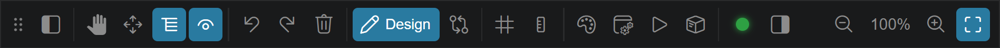

**Widok Zmiany (Changes)** — przycisk Zmiany jest aktywny i pokazuje liczbę oczekujących zmian.
Kontrolki zoomu znikają (należą do powierzchni projektu, nie do diffa), aktywne jest narzędzie
Przesuń, a kropka jest szara, bo to okno używa renderera web:

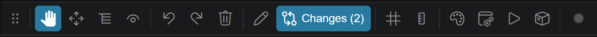

Te dwie różnice są od siebie niezależne: **panel zoomu znika wyłącznie dlatego, że tryb widoku to
Zmiany**, a **kolor kropki zależy tylko od silnika podglądu i statusu renderu hosta** — nie od
trybu widoku.

#### Wszystkie kontrolki, od lewej do prawej

| Ikona | Kontrolka | Typ | Działanie |
|:-----:|-----------|-----|-----------|
|  | **Przenieś pasek** | uchwyt | Przeciągnij pasek; upuść przy krawędzi, aby go zadokować. |
|  | **Pokaż Strukturę** | przycisk *(warunkowy)* | Otwiera z powrotem panel Struktury. Widoczny tylko, gdy panel jest zwinięty. |
|  | **Przesuń (Pan)** | narzędzie | Przeciąganie przewija podgląd. Dostępne też w każdej chwili środkowym przyciskiem myszy. |
|  | **Zaznacz / przesuń** | narzędzie | Zaznaczanie elementów, przeciąganie ich i zmiana rozmiaru 8 uchwytami. |
|  | **Kolejność** | narzędzie | Przeciąganie elementów w podglądzie zmienia ich kolejność wśród rodzeństwa, tak jak w drzewie. **To jest narzędzie domyślne.** |
|  | **Auto-podgląd** | przełącznik | Automatycznie rozwija listę/menu zaznaczonego elementu (ComboBox, Menu, …). **Domyślnie włączony.** |
|  | **Cofnij** | przycisk | Cofa ostatnią edycję (natywny stos undo VS Code). |
|  | **Ponów** | przycisk | Ponawia edycję. |
|  | **Usuń** | przycisk | Usuwa zaznaczony element (to samo, co klawisz <kbd>Del</kbd>). |
|  | **Projekt** | przełącznik widoku | Powierzchnia projektowa na żywo. Gdy aktywny, rozwija się w pigułkę z etykietą. |
|  | **Zmiany** | przełącznik widoku | Diff względem zapisanego pliku. Gdy aktywny, pokazuje *Zmiany (n)*; gdy nieaktywny — samo *n* jako plakietkę, a przy braku zmian nic. |
|  | **Siatka** | przełącznik | Nakładka siatki kropkowej. Włączenie jej włącza też przyciąganie do siatki — nie ma osobnego przycisku magnesu. **Domyślnie wyłączona.** |
|  | **Linijki** | przełącznik | Linijki, przeciągane prowadnice i przyciąganie do nich. **Domyślnie włączone.** |
|  | **Motyw podglądu** | menu | Motywy ze słowników zasobów znalezionych w projekcie, a potem zestaw standardowy: Classic, Classic '98, Systemowy, Jasny, Ciemny, Natywny. Zobacz [sekcję 6](#6-backendy-podglądu). |
|  | **Silnik podglądu** | menu | `Auto`, `Web`, a na Windows dodatkowo `Host WPF` i `Host WPF — izolowany`. Zobacz [sekcję 6](#6-backendy-podglądu). |
|  | **Uruchom okno** | menu | Otwiera XAML w prawdziwym oknie Windows: *Migawka* (jednorazowo) albo *Na żywo* (podąża za projektem). Tylko silnik WPF na Windows. |
|  | **Zasoby projektu** | dialog | Wybór bibliotek DLL z własnymi kontrolkami, `App.xaml` i słowników zasobów do wczytania. Zobacz [sekcję 7](#7-zasoby-projektu-host-wpf). |
|  | **Status hosta** | wskaźnik + przycisk | Stan hosta WPF (tabela niżej). Kliknięcie otwiera konsolę/log. |
|  | **Pokaż Właściwości** | przycisk *(warunkowy)* | Otwiera z powrotem panel Właściwości. Widoczny tylko, gdy panel jest zwinięty. |
|  | **Zmień rozmiar paska** | uchwyt *(warunkowy)* | Przeciągnij, aby zmienić rozmiar paska. Widoczny tylko, gdy pasek jest pływający (niezadokowany). |

Przesuń, Zaznacz i Kolejność wykluczają się wzajemnie — dokładnie jedno z nich jest zawsze aktywne.

#### Kropka statusu hosta

| Kropka | Znaczenie |
|:------:|-----------|
|  | Host WPF działa, a ostatni render się powiódł. |
|  | Host WPF się uruchamia. |
|  | Host WPF zgłosił błąd renderu. Konsola otwiera się automatycznie. |
|  | Brak hosta WPF: albo nie jesteś na Windows, albo silnik podglądu jest ustawiony na `Web`. To nie jest błąd. |

**Niebieski pierścień** wokół kropki oznacza, że aktualnie załadowane są zasoby projektu.
Kliknięcie kropki zawsze otwiera konsolę/log, niezależnie od jej koloru. Gdy host jest izolowany,
informuje o tym podpowiedź.

#### Panel zoomu

 


Zoom **nie jest częścią paska narzędzi** — to osobny panelik w prawym dolnym rogu podglądu:
*pomniejsz*, bieżący procent (kliknięcie przywraca 100 %), *powiększ* i *Dopasuj*. W widoku Zmiany
jest ukryty. Gdy pasek narzędzi jest zadokowany do dolnej krawędzi i starczy miejsca, panel zoomu
dokuje się do jego prawego końca — dlatego na zrzucie widoku Projekt wygląda to jak jeden pasek.

---

## 5. Funkcje

### 5.1 Drzewo struktury i zmiana kolejności

Drzewo odzwierciedla hierarchię XAML. Kliknij węzeł, by go zaznaczyć (odpowiadający element
zostaje podświetlony w podglądzie). **Przeciągnij węzeł**, by zmienić kolejność: strefy
upuszczenia wskazują *przed*, *do wnętrza* lub *po* elemencie docelowym, a upuszczenie do
własnego poddrzewa jest zablokowane. Przeniesienie jest zatwierdzane jako chirurgiczne
`moveElement`, z zachowaniem wcięć.

### 5.2 Edycja wizualna — przesuwanie i zmiana rozmiaru

Narzędziem **Zaznacz** kliknij element w podglądzie, aby go wybrać. Następnie:

- **Przesuwaj** przeciąganiem. Zależnie od layoutu rodzica, przesunięcie aktualizuje `Margin`
  (większość paneli) lub `Canvas.Left/Top` (wewnątrz `Canvas`).
- **Zmieniaj rozmiar** za pomocą **8 uchwytów** (rogi + krawędzie); aktualizuje to
  `Width`/`Height` (i `Margin`, gdy potrzeba).
- **Podgląd na żywo** podąża za gestem; po zwolnieniu zmiana jest zatwierdzana jednym
  chirurgicznym zapisem (`setAttributes`).

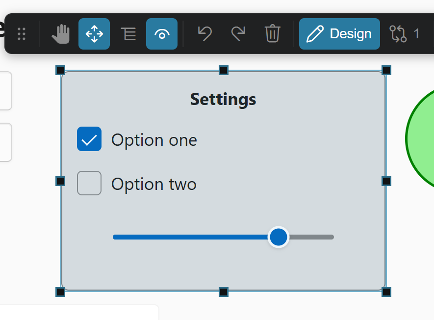

### 5.3 Dodawanie / usuwanie / kopiowanie elementów

- **Dodaj** element z paska narzędzi: wybierz spośród 15 popularnych typów (Grid, StackPanel,
  Canvas, Border, TextBlock, Label, Button, TextBox, CheckBox, RadioButton, Slider, ProgressBar,
  Image, Ellipse, Rectangle). Do zaznaczonego kontenera wstawiany jest domyślny snippet.
- **Usuń** zaznaczony element klawiszem **Delete**.
- **Kopiuj / wytnij / wklej** poddrzewo skrótami **Ctrl+C / Ctrl+X / Ctrl+V** (wklejenie jako rodzeństwo
  lub dziecko). Schowek jest **systemowy** — element kopiowany jest jako fragment XAML, więc działa też
  **między oknami XVE** oraz w obie strony z **edytorem tekstu**. Opcjonalna deduplikacja `x:Name`
  przy wklejaniu (ustawienie `xve.paste.nameDeduplication`, domyślnie wyłączona) zmienia kolidujące
  nazwy na unikalne — nie rusza przy tym oryginału.

### 5.4 Panel właściwości

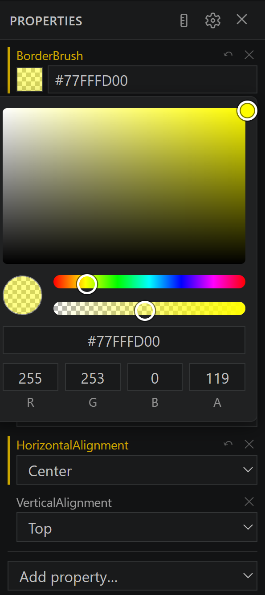

Panel pokazuje **typowane edytory** zależnie od rodzaju właściwości:

| Rodzaj | Edytor |
|--------|--------|
| `bool` | pole wyboru (checkbox) |
| `enum` | lista rozwijana |
| `number` | pole numeryczne |
| `brush` | próbnik koloru |
| `thickness` | cztery pola L,T,R,B |
| `string` | pole tekstowe |

Obejmuje właściwości wspólne (Name, Width/Height, rozmiary Min/Max, Margin, Padding, wyrównanie,
Background/Foreground, BorderBrush/Thickness, czcionki, Opacity, Visibility, IsEnabled…),
właściwości dołączone (`Grid.Row/Column`, `Canvas.Left/Top`, `DockPanel.Dock`) oraz specyficzne
dla typu (Text, Content, IsChecked, Value/Minimum/Maximum itd.).

Użyj **„+ Dodaj właściwość”**, by dodać dowolną znaną właściwość, oraz kontrolek przy atrybucie,
by ją usunąć. Atrybuty **zmienione od ostatniego zapisu** są oznaczone kolorowym paskiem i dostają
przycisk **revert** per atrybut — na zrzucie `BorderBrush` został zmieniony próbnikiem koloru,
a `VerticalAlignment` pozostaje nietknięty.

<br clear="right">

### 5.5 Widok zmian (diff)

Przełącz pasek z **Design** na **Changes**, aby zobaczyć wszystko, co różni się od **zapisanego
pliku**: zmienione atrybuty, dodane, usunięte i przeniesione elementy (wykrywane dopasowaniem
drzewa metodą LCS, więc reorder nie jest raportowany jako dodanie+usunięcie). Każda pozycja ma
przycisk **revert per-hunk**, jest też akcja **Revert all**. Klik w pozycję zaznacza element w
podglądzie. Revert używa tych samych operacji chirurgicznych co edycja.

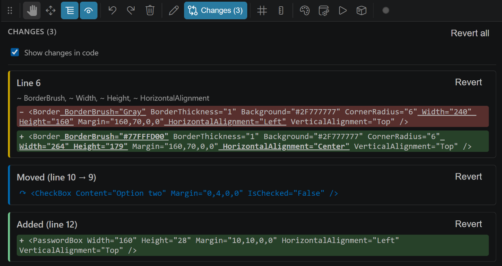

### 5.6 Zoom i nawigacja

Zoom obejmuje **10–800 %**. Użyj panelu zoomu w prawym dolnym rogu podglądu, **Ctrl+scroll**
(z zakotwiczeniem na kursorze) lub **Dopasuj**, by dopasować podgląd do okna. Domyślnie (`xve.preview.fitOnOpen`)
dokument jest dopasowywany przy otwarciu: pomniejszony, jeśli większy od widoku, w przeciwnym
razie pokazany w 100 % (nigdy nie powiększa). **Przesuwaj (Pan)** narzędziem Pan lub środkowym
przyciskiem myszy. Linijki, prowadnice i przyciąganie respektują bieżący zoom.

### 5.7 Linijki, prowadnice i przyciąganie do siatki

Z paska narzędzi przełączasz **linijki** (góra/lewo) i nakładkę **siatki** kropkowej. Dodaj
**prowadnicę** klikając w linijkę; przeciągnij, by przesunąć, podwójny klik, by usunąć. Podczas
przesuwania/zmiany rozmiaru elementy **przyciągają się** do siatki i prowadnic. Krok siatki i
próg przyciągania ustawia `xve.canvas.gridStep` (domyślnie 8 px).

### 5.8 Synchronizacja zaznaczenia z edytorem tekstu

Gdy edytor tekstu jest otwarty obok, zaznaczenie jest **dwukierunkowe**:

- **Wizualny → tekst** (`xve.sync.selectInTextEditor`): zaznaczenie elementu przesuwa kursor
  tekstu do jego tagu otwierającego. Poniżej: wybranie drugiego `CheckBox` w drzewie struktury
  przenosi edytor do linii 10.

  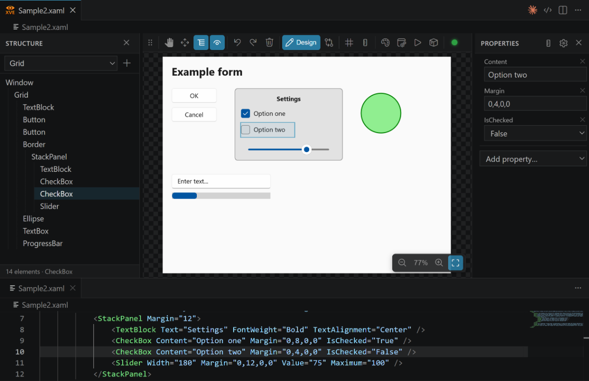

- **Tekst → wizualny** (`xve.sync.selectFromTextCursor`): ruch kursora w kodzie zaznacza
  odpowiadający element w podglądzie. Poniżej: kursor stoi w linii 9, a pierwszy `CheckBox` jest
  zaznaczony w podglądzie, wraz z uchwytami zmiany rozmiaru.

  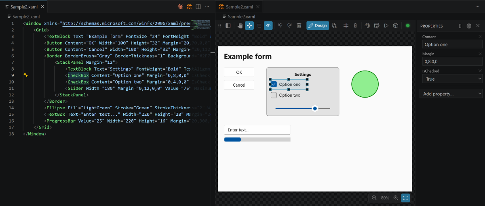

Oba kierunki są domyślnie włączone i można je przełączać niezależnie. Edytor tekstu może być
podzielony pod edytorem wizualnym albo umieszczony obok — obie aranżacje działają.

### 5.9 Język interfejsu

Interfejs jest zlokalizowany na **7 języków**. Ustaw `xve.language` (pusty = zgodnie z VS Code).
Po zmianie przeładuj webview skrótem **Ctrl+R**, aby zastosować.

---

## 6. Backendy podglądu

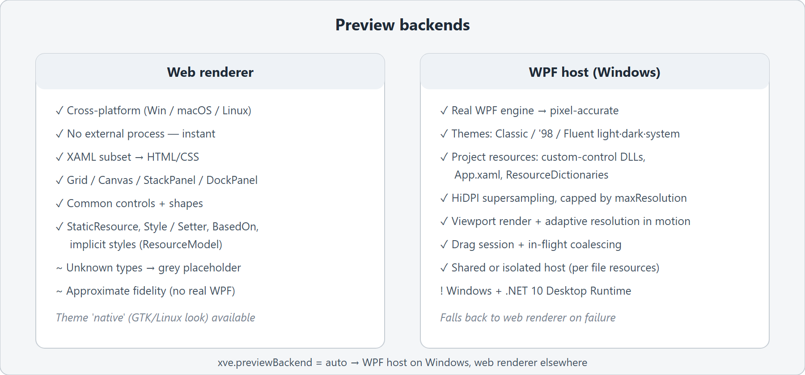

XVE ma dwa silniki renderowania, wybierane przez **`xve.previewBackend`**:

- **`auto`** (domyślnie) — host WPF na Windows, web renderer wszędzie indziej.
- **`web`** — wieloplatformowy web renderer (subset XAML → HTML/CSS).
- **`wpf-host`** — host WPF na Windows (prawdziwy silnik WPF, wysoka wierność).

Silnik można też nadpisać per okno z selektora silnika na pasku, który oferuje czwartą pozycję —
*Host WPF — izolowany* (zob. [Izolacja](#izolacja-xvepreviewisolation) niżej). Jeśli host WPF
zawiedzie lub przekroczy limit czasu, XVE automatycznie przełącza się na web renderer; jeśli host
w ogóle nie może wystartować — najczęściej dlatego, że nie zainstalowano **.NET 10 Desktop
Runtime** — dostajesz powiadomienie z linkiem do pobrania.

### Style i zasoby w rendererze web

Web renderer to więcej niż mapowanie tagów na `<div>`. Przed renderem XVE wyciąga z dokumentu ten
podzbiór zasobów, który da się odwzorować w CSS, i stosuje go:

- **Pędzle** — zasoby `SolidColorBrush` i `ImageBrush` wskazywane kluczem.
- **Style** — `Style` z prostymi `Setter`ami (właściwościami, które renderer rozumie), w tym
  **łańcuchy `BasedOn`**, które są spłaszczane.
- **Style niejawne** — bezkluczowy `Style` z `TargetType` obowiązuje każdy element tego typu,
  dokładnie jak w WPF.
- **Wyszukiwanie zasobów** — `{StaticResource klucz}` i `{DynamicResource klucz}` są rozwiązywane
  względem słowników zasobów dokumentu.

Pierwszeństwo jak w WPF: styl niejawny → styl nazwany (wraz z jego łańcuchem `BasedOn`) → atrybut
inline, przy czym atrybut inline zawsze wygrywa. Wszystko spoza tego podzbioru (triggery, szablony,
konwertery, bindowania do danych) web renderer pomija — gdy potrzebujesz tego wiernie, użyj hosta WPF.

### Motywy podglądu

Wybór motywu () oferuje zestaw standardowy — **Classic**
(zwykły WPF), **Classic '98** oraz warianty Fluent **Jasny** / **Ciemny** / **Systemowy**, które host
WPF stosuje przez `ThemeMode`. Nad nimi wypisane są **motywy ze słowników zasobów znalezione
w Twoim projekcie** i można je zastosować tak samo. `Natywny` to wygląd GTK/Linux i działa tylko
w rendererze web (host WPF wraca do Classic).

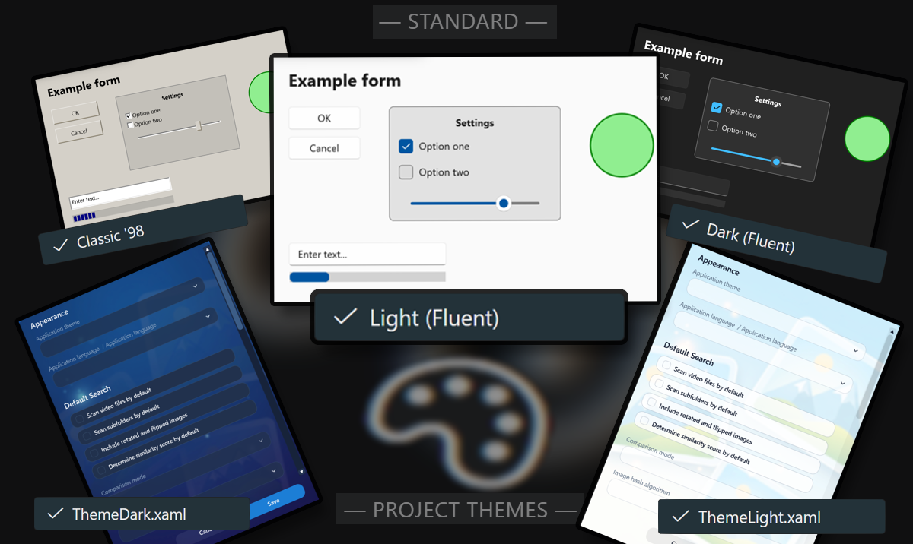

### Opcje hosta WPF

| Ustawienie | Cel |
|------------|-----|
| `xve.preview.theme` | Motyw podglądu: `none` (Classic), `classic98`, `system`/`light`/`dark` (Fluent), `native` (wygląd GTK tylko dla web). |
| `xve.preview.renderScale` | Supersampling: `auto` = device pixel ratio (ostro na HiDPI), albo `1`/`1.5`/`2`/`3`. |
| `xve.preview.maxResolution` | Limit rozmiaru bitmapy (dłuższy bok, px urządzenia). `0` = bez limitu. |
| `xve.preview.viewportRender` | Renderuj tylko widoczny obszar — szybciej dla dużych projektów. |
| `xve.preview.capBasis` | Render widocznego obszaru: czy `maxResolution` liczyć wg samego widocznego obszaru (`visible`, stała ostrość niezależnie od rozmiaru okna) czy całego wycinka z overscanem (`slice`, dawne zachowanie). |
| `xve.preview.overscan` | Render widocznego obszaru: dodatkowy zapas (jednostki projektu) renderowany wokół widocznego obszaru przy przewijaniu. |
| `xve.preview.debugConsole` | Pokaż konsolę debug na dole podglądu z telemetrią renderu. |
| `xve.preview.consoleOnStart` | Zadokuj konsolę na czas startu hosta. Wyłączona — i tak otworzy się sama przy błędzie renderu. |
| `xve.preview.isolation` | Czy plik dostaje własny proces hosta i zasoby (zob. niżej). |

### Rozdzielczość adaptacyjna

Renderowanie dużej powierzchni w pełnej rozdzielczości HiDPI przy każdej klatce przeciągania jest
kosztowne. Przy **`xve.preview.adaptiveRes`** (**domyślnie włączone**) host renderuje w obniżonej
rozdzielczości (`xve.preview.motionResolution`, domyślnie 512 px dłuższego boku) *w trakcie
przeciągania, przewijania lub zoomowania*, a gdy tylko ruch ustanie — renderuje raz w pełnym
`maxResolution`. Szybki ruch pozostaje płynny, a nieruchomy obraz ostry.

Degradacja nie jest bezwarunkowa: włącza się dopiero, gdy render w pełnej rozdzielczości schodzi
poniżej **`xve.preview.adaptiveFpsThreshold`** klatek na sekundę (domyślnie 30). Na szybkiej maszynie
przy małym projekcie nigdy więc nie opuszczasz pełnej rozdzielczości. Ustaw próg na `0`, aby w ruchu
zawsze używać rozdzielczości ruchu.

### Strategia podglądu na żywo przy przeciąganiu/zmianie rozmiaru

Podczas przeciągania/zmiany rozmiaru w trybie hosta WPF ponowny render na żywo zależy od:

- `xve.preview.dragStrategy` — `overlay` (bez renderu na żywo), `frames` (co N klatek) lub
  `ms` (co N milisekund, domyślnie).
- `xve.preview.dragIntervalMs` (domyślnie 25), `xve.preview.dragFrames` (domyślnie 2).
- `xve.preview.dragCoalesce` — najwyżej jeden render w locie (porzucanie nieaktualnych klatek).
- `xve.preview.dragSession` — parsuj raz i mutuj zbuforowane drzewo zamiast parsować ponownie.
- `xve.preview.dragOnChange` — renderuj nową klatkę tylko wtedy, gdy atrybuty przeciąganego elementu
  faktycznie się zmieniły; trzymanie nieruchomego kursora nic nie kosztuje.
- `xve.preview.debugLiveDrag` — odświeżaj telemetrię konsoli debug także przy każdej klatce przeciągania.

### Izolacja (`xve.preview.isolation`)

Host WPF może ładować zasoby projektu, które wpływają na render typów niestandardowych.
Izolacja decyduje, czy plik współdzieli host, czy dostaje własny:

- `ask` — dla pliku z innego projektu (lub bez projektu) zapytaj, czy go izolować.
- `auto` (domyślnie) — izoluj takie pliki automatycznie; współdziel jeden host w obrębie
  otwartego projektu.
- `shared` — nigdy nie izoluj (jeden host na wszystko).
- `isolated` — zawsze izoluj (osobny host na plik).

---

## 7. Zasoby projektu (host WPF)

Dla wiernego podglądu **kontrolek niestandardowych** i motywów projektu host WPF może załadować
zasoby Twojego projektu. XVE skanuje w górę od pliku XAML w poszukiwaniu `.csproj`, potem
znajduje najlepsze wyjście `bin/<Config>/<tfm>` oraz `App.xaml` i słowniki zasobów.

- Wybór proponowany jest w **QuickPick** i zapamiętywany per projekt; politykę ustawia
  **`xve.project.autoLoadResources`** (`ask` / `always` / `never`).
- Host ładuje **DLL** kontrolek niestandardowych (przez `AssemblyResolve` dla typów
  `clr-namespace`) i scala `App.xaml` / słowniki do `Application.Resources`.
- Użyj przycisku **Zasoby projektu** () na pasku podglądu, by
  w każdej chwili ponowić wybór zasobów.

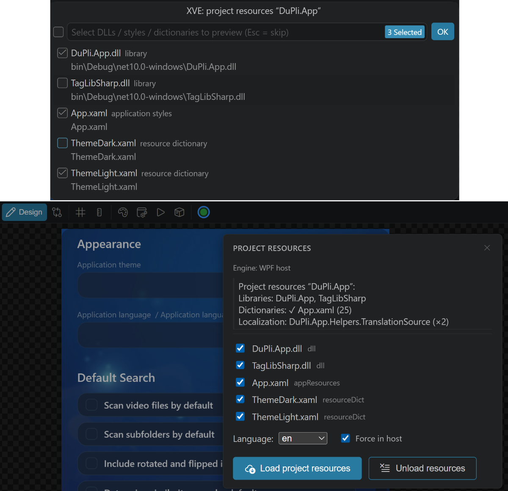

---

## 8. Obsługa błędów

Gdy XAML nie parsuje się lub nie renderuje, XVE pomaga go zlokalizować i naprawić:

- **Podświetlanie zmian w kodzie** (`xve.editor.highlightChanges`) — zmienione linie są
  kolorowane w edytorze tekstu obok (odzwierciedla przełącznik panelu Changes).
- **Podświetlanie błędów w kodzie** (`xve.editor.highlightErrors`) — linia błędu jest kolorowana,
  a problematyczny token podkreślony. Klik w błąd ujawnia go w edytorze tekstu.
- **Sugestie auto-fix** — dla nieznanego typu lub właściwości XVE sugeruje najbliższą znaną nazwę
  (np. `Buton` → `Button`) na podstawie odległości edycyjnej.
- **Konsola** — kliknij kropkę statusu hosta, aby ją otworzyć. Przy błędzie renderu otwiera się sama,
  niezależnie od `xve.preview.consoleOnStart`.

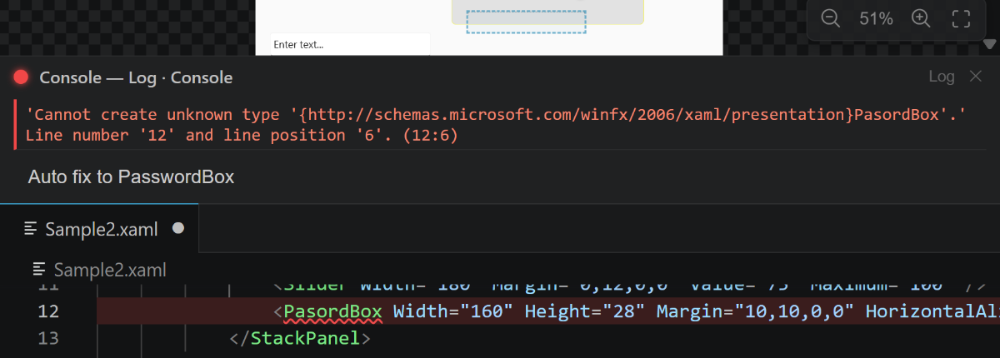

### Gdy host WPF nie może wystartować

Jeśli brakuje pliku wykonywalnego hosta, nie zainstalowano **.NET 10 Desktop Runtime** albo proces
pada przy starcie, XVE pokazuje powiadomienie wyjaśniające, który z tych trzech przypadków zaszedł,
i po cichu przechodzi na web renderer. Powiadomienie proponuje pobranie środowiska uruchomieniowego
albo przełączenie `xve.previewBackend` na `web`, żeby host w ogóle przestał być uruchamiany. Każdy
rodzaj awarii zgłaszany jest raz na sesję.

---

## 9. Wykaz ustawień

Wszystkie ustawienia są pod **`xve.*`**. Większość ma zasięg okna, więc różne okna VS Code mogą
się różnić. Domyślne wartości poniżej odpowiadają `package.json`.

| Ustawienie | Typ | Domyślnie | Opis |
|------------|-----|-----------|------|
| `xve.language` | enum | `""` | Język UI (`""`=zgodnie z VS Code, `en`,`pl`,`es`,`de`,`fr`,`ja`,`zh`). Przeładuj Ctrl+R. |
| `xve.project.autoLoadResources` | enum | `ask` | Jak ładować zasoby projektu dla hosta WPF: `ask` / `always` / `never`. |
| `xve.sync.selectInTextEditor` | bool | `true` | Zaznaczenie elementu przesuwa kursor tekstu do niego. |
| `xve.sync.selectFromTextCursor` | bool | `true` | Ruch kursora tekstu zaznacza odpowiadający element. |
| `xve.editor.highlightChanges` | bool | `true` | Koloruj zmienione linie w edytorze tekstu. |
| `xve.editor.highlightErrors` | bool | `true` | Koloruj/podkreślaj linię błędu w edytorze tekstu. |
| `xve.paste.nameDeduplication` | enum | `off` | Kolizje `x:Name` przy wklejaniu: `off` (wklej jak jest) / `rename` / `renameAndReferences` (dodatkowo poprawia `ElementName`, `x:Reference` we wklejonym poddrzewie). |
| `xve.previewBackend` | enum | `auto` | Silnik podglądu: `auto` / `web` / `wpf-host`. |
| `xve.preview.isolation` | enum | `auto` | Izolacja hosta WPF: `ask` / `auto` / `shared` / `isolated`. |
| `xve.preview.renderScale` | enum | `auto` | Supersampling: `auto` / `1` / `1.5` / `2` / `3`. |
| `xve.preview.maxResolution` | number | `1536` | Maks. rozmiar bitmapy (dłuższy bok, px urządzenia). `0`=bez limitu. |
| `xve.preview.theme` | enum | `none` | Motyw podglądu: `none` / `classic98` / `system` / `light` / `dark` / `native`. |
| `xve.preview.viewportRender` | bool | `true` | Renderuj tylko widoczny obszar. |
| `xve.preview.capBasis` | enum | `visible` | Render widocznego obszaru: podstawa limitu — `visible` / `slice`. |
| `xve.preview.overscan` | number | `100` | Render widocznego obszaru: zapas (jednostki projektu) wokół widocznego obszaru. |
| `xve.preview.debugConsole` | bool | `false` | Konsola debug z telemetrią renderu na dole podglądu. |
| `xve.preview.consoleOnStart` | bool | `true` | Zadokuj konsolę na czas startu hosta. Wyłączona = ukryta przy starcie, ale nadal pokazywana przy błędzie renderu. |
| `xve.preview.debugLiveDrag` | bool | `false` | Odświeżaj telemetrię konsoli także przy każdej klatce przeciągania. |
| `xve.preview.dragStrategy` | enum | `ms` | Strategia przeciągania na żywo: `overlay` / `frames` / `ms`. |
| `xve.preview.dragIntervalMs` | number | `25` | Dla `ms`: min. interwał między renderami na żywo (ms). |
| `xve.preview.dragFrames` | number | `2` | Dla `frames`: render co N klatek. |
| `xve.preview.dragCoalesce` | bool | `true` | Najwyżej jeden render w locie podczas przeciągania/scrolla. |
| `xve.preview.dragSession` | bool | `true` | Trwała sesja przeciągania (parsuj raz, mutuj zbuforowane drzewo). |
| `xve.preview.dragOnChange` | bool | `true` | Podczas przeciągania renderuj tylko wtedy, gdy atrybuty elementu faktycznie się zmienią. |
| `xve.preview.adaptiveRes` | bool | `true` | Rozdzielczość adaptacyjna: w ruchu renderuj w `motionResolution`, po zatrzymaniu raz w pełnym `maxResolution`. |
| `xve.preview.motionResolution` | number | `512` | Rozdzielczość (dłuższy bok, px urządzenia) używana w ruchu, gdy rozdzielczość adaptacyjna jest włączona. |
| `xve.preview.adaptiveFpsThreshold` | number | `30` | Zejdź do `motionResolution` tylko wtedy, gdy render w pełnej rozdzielczości schodzi poniżej tylu FPS. `0` = zawsze. |
| `xve.preview.fitOnOpen` | bool | `true` | Dopasuj podgląd do okna przy otwarciu (nigdy nie powiększaj). |
| `xve.canvas.gridStep` | number | `8` | Krok siatki i próg przyciągania, w pikselach. |
| `xve.canvas.showGrid` | bool | `false` | Domyślne pokazywanie nakładki siatki kropkowej. |
| `xve.canvas.showRulers` | bool | `true` | Domyślne pokazywanie linijek/prowadnic. |

### Komendy

| Komenda | Tytuł | Kiedy |
|---------|-------|-------|
| `xve.openVisualEditor` | XVE: Open in XAML Visual Editor | `.xaml` otwarty jako tekst |
| `xve.openTextEditor` | XVE: Open XAML as Text | `.xaml` otwarty w edytorze wizualnym |

---

## 10. Skróty klawiszowe

| Skrót | Działanie |
|-------|-----------|
| **Ctrl+Z / Ctrl+Y** | Cofnij / ponów (natywne VS Code, przez TextDocument) |
| **Delete** | Usuń zaznaczony element |
| **Ctrl+C / Ctrl+X / Ctrl+V** | Kopiuj / wytnij / wklej zaznaczone poddrzewo (schowek systemowy, XAML) |
| **Ctrl+scroll** | Zoom in/out z zakotwiczeniem na kursorze |
| **Środkowy przycisk myszy / narzędzie Pan** | Przesuwanie płótna |
| **Ctrl+R** | Przeładuj webview (np. by zastosować zmianę języka) |

XVE nie rejestruje własnych skrótów; korzysta z wbudowanych komend edytora VS Code.

---

## 11. Architektura

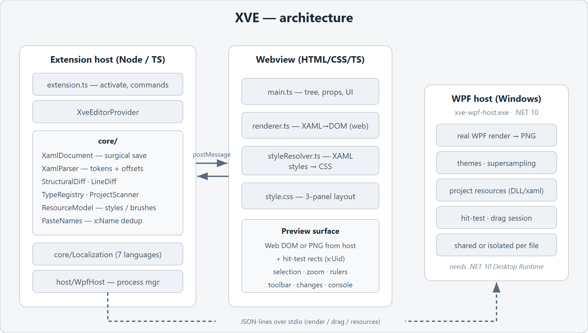

Wtyczka działa w dwóch współpracujących kontekstach, plus opcjonalny host natywny:

- **Extension host (Node/TS)** — `extension.ts` aktywuje wtyczkę i rejestruje komendy;
  `XveEditorProvider` jest `CustomTextEditorProvider`. Prawdziwą pracę wykonują moduły `core/`:
  `XamlDocument` (chirurgiczny zapis), `XamlParser` (pozycyjny tokenizer), `StructuralDiff` /
  `LineDiff`, `TypeRegistry` (typy i metadane właściwości), `ResourceModel` (pędzle, style,
  `BasedOn`), `ProjectScanner` (`.csproj` → DLL-e i słowniki), `PasteNames` (deduplikacja
  `x:Name`) oraz `Localization`. `host/WpfHost` zarządza procesem hosta WPF i zgłasza twarde
  awarie startu.
- **Webview (HTML/CSS/TS)** — `main.ts` obsługuje drzewo, właściwości, pasek narzędzi i UI;
  `renderer.ts` to webowy renderer XAML→DOM; `styleResolver.ts` nakłada wyciągnięte style/zasoby
  XAML jako CSS; `style.css` to układ trzech paneli. Komunikuje się z extension host przez
  `postMessage`.
- **Host WPF (Windows)** — `xve-wpf-host.exe` (.NET 10) renderuje XAML prawdziwym silnikiem WPF
  do PNG plus mapa hit-test (przez wstrzyknięte `x:Uid`), protokołem JSON-lines przez stdio. Może
  działać współdzielony w obrębie projektu albo izolowany per plik.

### Przepływ edycji

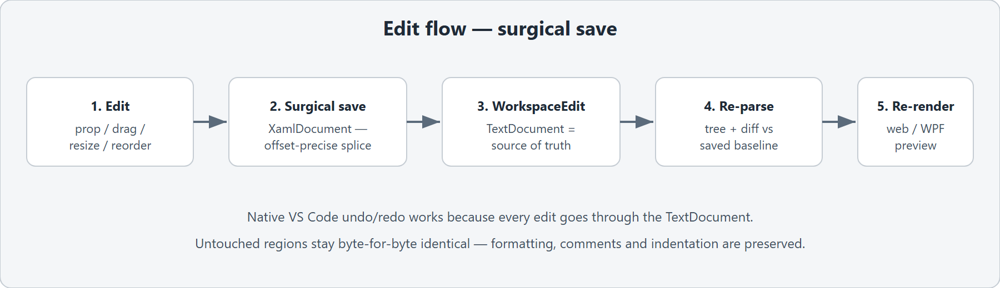

Każda edycja — zmiana właściwości, przeciągnięcie/zmiana rozmiaru, reorder — jest zamieniana w
najmniejszy zestaw edycji tekstu przez `XamlDocument`, nanoszona przez `WorkspaceEdit`, po czym
dokument jest ponownie parsowany, a podgląd renderowany na nowo. Ponieważ `TextDocument` jest
zawsze źródłem prawdy, cofanie/ponawianie jest natywne, a nietknięte obszary nigdy się nie zmieniają.

---

## 12. Pliki przykładowe

Folder `samples/` zawiera pliki XAML, które możesz otworzyć, by poznać edytor:

| Plik | Co demonstruje |
|------|----------------|
| [`samples/SampleGrid.xaml`](../../samples/SampleGrid.xaml) | Układ formularza w `Grid` z `RowDefinitions`/`ColumnDefinitions`, span i wyrównaniem. |
| [`samples/SampleControls.xaml`](../../samples/SampleControls.xaml) | `Menu`, `ComboBox` i `ScrollViewer` — dobre do testu auto-rozwijania list i przewijania per obszar. |
| `samples/Sample.xaml`, `Sample2.xaml` | Podstawowe przykłady `Window` + `StackPanel`. |

W `SampleControls.xaml` zaznacz `MenuItem` lub `ComboBox` przy włączonym auto-podglądzie, by
rozwinąć submenu/listę; najedź na `ScrollViewer` i użyj kółka, by przewinąć tylko ten obszar.

---

## 13. Rozwiązywanie problemów / FAQ

**Plik `.xaml` otwiera się jako zwykły tekst, a nie edytor wizualny.**
To zamierzone — edytor wizualny jest *opcją*. Użyj przycisku na pasku tytułu lub
`xve.openVisualEditor`, by przełączyć.

**Podgląd wygląda przybliżeniowo / kontrolki niestandardowe są placeholderami.**
Prawdopodobnie używasz web renderera. Na Windows ustaw `xve.previewBackend` na `auto` lub
`wpf-host`, a następnie załaduj [zasoby projektu](#7-zasoby-projektu-host-wpf) przyciskiem
**Zasoby projektu**.

**Kropka statusu hosta jest stale szara, a podgląd nigdy nie używa WPF.**
Szary oznacza, że host nie jest aktywny — albo nie jesteś na Windows, albo `xve.previewBackend` ma
wartość `web`. Jeśli przełączyłeś na `wpf-host`, a kropka nadal jest szara, poszukaj powiadomienia
o błędzie: najczęstszą przyczyną jest brak
[.NET 10 Desktop Runtime](https://dotnet.microsoft.com/download/dotnet/10.0). Uwaga: środowisko
*Desktop* to osobny plik do pobrania niż zwykłe środowisko .NET.

**Typy niestandardowe nadal nie renderują się w hoście WPF.**
Upewnij się, że projekt jest zbudowany (czyli DLL-e istnieją w `bin/...`) i że wybrałeś właściwe
zasoby. Kliknij kropkę statusu hosta, aby przeczytać log.

**Interfejs jest w złym języku.**
Ustaw `xve.language` i przeładuj webview skrótem **Ctrl+R**.

**Duże projekty są wolne przy przeciąganiu.**
Trzymaj włączone `xve.preview.viewportRender` i `xve.preview.adaptiveRes` — razem renderują tylko
widoczny obszar, i to w obniżonej rozdzielczości podczas ruchu. Jeśli nadal jest ciężko, obniż
`xve.preview.motionResolution` (np. do 384) albo podnieś `xve.preview.adaptiveFpsThreshold`, żeby
tryb niskiej rozdzielczości włączał się wcześniej. Ustawienie go na `0` sprawia, że w ruchu zawsze
używana jest rozdzielczość ruchu. `dragStrategy` zostaw na `ms`.

---

## 14. Historia rozwoju

XVE powstawał etapami. Skrócona historia:

- **Etap 8** — wierność layoutu i właściwości: koercja rozmiaru jak w WPF w web rendererze,
  komplet właściwości wspólnych, wierny `Grid` (`RowDefinitions`/`ColumnDefinitions`, span,
  wyrównanie w komórce), **reorder** drzewa oraz **zasoby projektu** dla hosta WPF.
- **Etap 7** — render w rozdzielczości ekranu (`renderScale`, domyślnie `auto`=device pixel
  ratio), VS Code jako źródło prawdy dla `xve.preview.*` oraz praca nad wydajnością hosta
  (debounce + koalescencja, cache `ThemeMode`, reużycie `RenderTargetBitmap`, pre-warm hosta).
- **Etap 6** — **zoom** (10–800 %, Ctrl+scroll, Dopasuj), **host WPF** (`wpf-host/`, .NET 10,
  JSON-lines), render widocznego obszaru, limit rozdzielczości i panel ustawień.
- **Etap 4** — `LineDiff` + `StructuralDiff` i widok **Changes** z revert per-hunk i Revert all.
- **Etap 3** — edycja wizualna (drag/resize), operacje strukturalne w `XamlDocument`, pasek
  dodawania/usuwania oraz linijki/prowadnice/snap ze stabilnym viewportem.
- **Wcześniej** — edytor własny dla `*.xaml`, `XamlDocument` + pozycyjny `XamlParser`, web
  renderer, dwukierunkowa selekcja, typowany panel właściwości, lokalizacja (7 języków) oraz
  testy round-trip / surgical-save.
